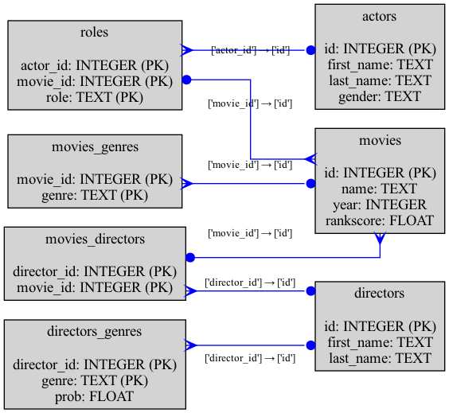

# Database Schema Visualizer

This project is a web application that allows users to upload SQLite database files and visualize their schema using Graphviz. The application is built with Flask and SQLAlchemy.

## Features

- Upload SQLite database files (`.db`, `.sqlite`, `.sqlite3`)
- Generate and display schema diagrams
- Option to include column details in the schema diagram

## Requirements

- Flask
- SQLAlchemy
- Graphviz

## Installation

1. Clone the repository:

    ```sh
    git clone https://github.com/TheurgicDuke771/SQLite_Schema_Visualizer.git
    cd SQLite_Schema_Visualizer
    ```

2. Install the required Python packages:

    ```sh
    pip install -r requirements.txt
    ```

3. Ensure Graphviz is installed on your system. You can download it from [Graphviz](https://graphviz.org/download/).

## Usage

1. Run the Flask application:

    ```sh
    python app.py
    ```

2. Open your web browser and navigate to `http://127.0.0.1:5000/`.

3. Upload an SQLite database file and optionally select the "Show Columns" checkbox to include column details in the schema diagram.

4. Click "Generate Schema" to visualize the database schema.

## Example Schema

Here is an example of a generated schema:



## Project Structure

```
sqlite-schema-visualizer/
│
├── app.py                  # Main Flask application
├── uploads/                # Folder for uploaded files and generated images
├── templates/              # HTML templates
│   ├── index.html          # Upload form
│   └── results.html        # Results page
├── requirements.txt        # Python dependencies
└── SQL_Scripts             # Directory containing sample SQL scripts
```

## License

This project is licensed under the MIT License.
